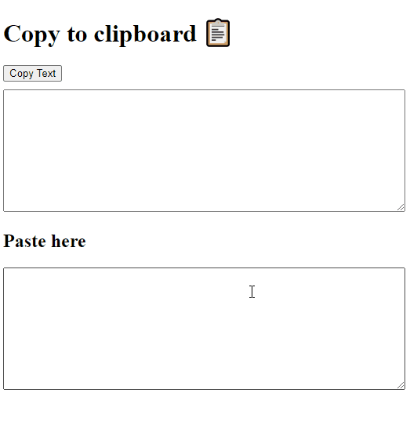

# copy_clipboard

Using [navigator.clipboard.writeText()](https://alligator.io/js/async-clipboard-api/) to copy the value of a textarea on clipboard instead of [Document.execCommand()](https://developer.mozilla.org/en-US/docs/Web/API/Document/execCommand)

